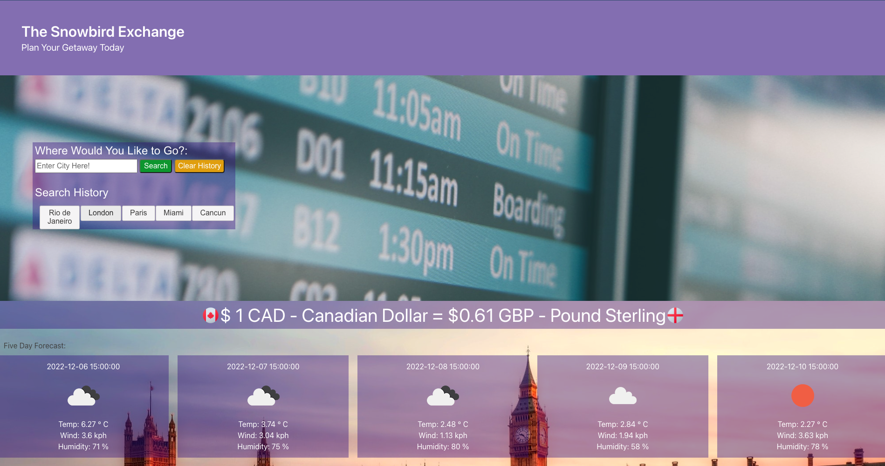

# the-snowbird-exchange
A weather and currency exchange website for Canadians looking to winter abroad.

## Table-of-Contents

- [About The Project](#About-The-Project)
- [Tasks Completed](#Tasks-Completed)
- [Links](#Links)
- [Screenshot](#Screenshot)
- [Technologies Used](#Technologies-Used)
- [Used API](#Used-API)
- [License](#license)
- [Credits](#credits)

## About-The-Project

In this project, we developed an application for Canadians seeking to escape winter in Mexico, the United States, England, France, and Brazil. The user can check the weather and current exchange rates for the most popular destinations so that they can plan their trip in advance and get the best value for their budget.

## Tasks-Completed

- User can select the language either English or French
- Local storage is used to store the language preference
- Search input for the city user desires to visit
- Autocomplete for the search bar
- The server-side API used to get response data object is retrieved from the Geo-location API and fed to the Open Weather API and exchange rate API
- User can check the current exchange rates
- User can check the 5 days weather forecast with the temperature, the humidity, and the wind speed
- The user can also clear the search history by clicking the clear history button
- Search history displays recent searches and will run search again if clicked

## Links

Website URL     -  

Repository URL  -  https://github.com/Meduion/the-snowbird-exchange

## Screenshot

## Technologies-Used

* HTML
* CSS
* JavaScript
* JQuery
* Bulma

## Used-API

* ExchangeRate-API -- https://www.exchangerate-api.com/docs/standard-requests
* OpenWeather API - 5 day weather forecast -- https://openweathermap.org/forecast5
* OpenWeather API - Direct geocoding -- https://openweathermap.org/api/geocoding-api

## License

Distributed under the MIT License

## credits

- HTML, CSS, and Javascript written by Aung Phyo Han, Brian Wyatt, and Stephen Brown

- W3school (https://www.w3schools.com/)

- JQuery (https://www.JQuery.com)

- Bulma (https://bulma.io/)

- Photos used under free use from Pexels.com
    https://www.pexels.com/photo/aerial-view-of-a-city-during-sunset-8574509/
    https://www.pexels.com/photo/parked-boat-1450353/
    https://www.pexels.com/photo/big-ben-bridge-castle-city-460672/
    https://www.pexels.com/photo/christ-the-redeemer-2868242/
    https://www.pexels.com/photo/glass-building-1796725/
    https://www.pexels.com/photo/airplanes-on-the-runway-at-sunset-11618705/
